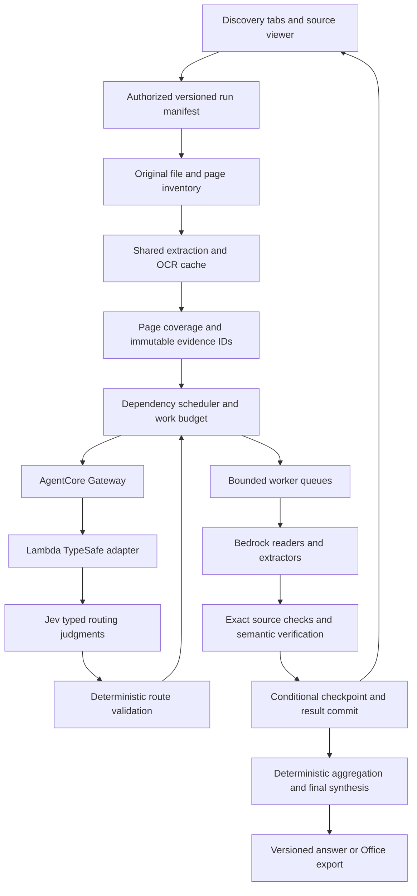

# Discovery: accuracy, throughput, and durable execution

> Published handoff: this is an audit of the source commit below, not a claim that the recommended fixes are implemented. Recorded JSON results are included. Original local probe scripts, raw logs, and browser traces are not part of this package. Reproduce the stated cases against your checkout; see [validation evidence](validation-evidence.json) and the [implementation runbook](../IMPLEMENTATION-RUNBOOK.md).

Read-only audit of `fshahersw/workingversion`, branch `codex/office-pdf-quality`, commit `f06e148fdda93553718621ab3634ce53548d7bfe`, on September 21, 2026. **Frontier is legacy and excluded from the proposed architecture.** Application code was not changed. Findings distinguish source tracing, synthetic counterexamples, browser checks, and unverified production behavior.

The strongest opportunity is to preserve evidence and completed work, then schedule less redundant work in parallel. Increasing model concurrency alone would amplify existing coverage gaps, stale writes, and retries. Jev can make bounded routing judgments through AgentCore; deterministic code must own authorization, dependencies, revisions, coverage, and completion.

## What actually runs

The current entry is `/docs`, with Working Set, Depositions, and Tabular Review. `/discovery` redirects there. Depositions and Review remain mounted across tab switches; their analysis execution is still substantially browser-orchestrated. A saved workspace and a resumable analysis job are different capabilities.

| Surface | Active behavior | Existing useful protections | Main limitation |
|---|---|---|---|
| Working Set | Local extraction/index; automatic save; small text inline, large text queued, textless originals through BDA; saved Ask retrieves Aurora passages, reranks, reads documents, synthesizes | Owned workspaces, selected-document filtering, source IDs, partial-ready indication, local retrieval fallback for some failures | Retrieval is not exhaustive; mixed scanned/text documents can lose coverage; follow-up UI is disabled by an obsolete scope condition |
| Depositions | Parse testimony; covering analysis windows; global synthesis; pairwise review of finding batches; graph/insights and source-linked export | Exact quotation matching within a named transcript, ambiguous matches rejected, bounded pools, optimistic saved-analysis revisions | Parser can omit continuation pages or invent line coordinates; comparison calls grow quadratically; execution checkpoints are in memory |
| Tabular Review | Full scan by default; columns sequential, three documents concurrently, sections sequential; extract → citation check → model verification → conditional escalation; optional retrieval mode | Content-aware cache keys, full-scan exact quote recheck, list merging, scalar-conflict flags, manual flags protected from ordinary AI writes, failed save batches retained | Concurrency races, silent list limits, repeated per-column scans, incomplete durable resume, inconsistent reopened OCR behavior |
| Shared ingestion/storage | S3 original/page records, DynamoDB workspace/jobs/review state, Aurora chunks/vectors, SQS/BDA workers | Owner checks/RLS in source, transactional chunk replacement, BDA leases/reconciliation, saved page recovery | Text-worker retry semantics differ from BDA; extraction/index readiness can overstate completeness; deployed configuration not verified |

Source entry points: [DocsWorkspace](https://github.com/fshahersw/workingversion/blob/f06e148fdda93553718621ab3634ce53548d7bfe/src/components/docs/DocsWorkspace.tsx), [Working Set hook](https://github.com/fshahersw/workingversion/blob/f06e148fdda93553718621ab3634ce53548d7bfe/src/lib/use-pile.ts), [deposition hook](https://github.com/fshahersw/workingversion/blob/f06e148fdda93553718621ab3634ce53548d7bfe/src/lib/use-deposition.ts), [review hook](https://github.com/fshahersw/workingversion/blob/f06e148fdda93553718621ab3634ce53548d7bfe/src/lib/review/use-review-table.ts), and [workspace functions](https://github.com/fshahersw/workingversion/blob/f06e148fdda93553718621ab3634ce53548d7bfe/src/lib/kb/workspace.functions.ts).

Current declared limits are not a throughput guarantee: Working Set allows 120 files/20,000 aggregate pages, 8,000 pages per file and 150 MiB file input; Depositions 20 files/5,000 aggregate pages/200 MiB input; Review permits 40 columns, potentially 4,800 visible cells. Original preservation permits 200 MiB while BDA conversion has a separate 50 MiB limit. These boundaries need a single preflight contract so a file accepted for reading does not unexpectedly fail a later conversion stage. See `pile/limits.ts`, `review/types.ts`, and `kb/ingest-state.ts`.

## Findings that should control implementation order

### 1. P1: completeness can be lost before the models see evidence

**Mixed scanned/text PDFs.** The browser detects empty/poor pages, but still submits available text. Server routing treats any text as eligible for text ingestion and receives no expected-page coverage constraint. One text page can therefore make a larger partly scanned file appear indexed while its scanned pages remain absent. This is source-confirmed at `use-pile.ts:1700–1726`, `workspace.functions.ts:153–165`, and `ingest-state.ts:93–99`.

**BDA segments and citation pages.** Actual-function probes show that whole-document markdown can suppress page anchors, separate segments can restart page numbering, and a failed segment read can be skipped without a partial-result flag. The downstream worker can mark the surviving content ready. See `agents/bda.server.ts:258–288`, `kb/convert.ts:94–124`, and the [ingestion audit](ingest-kb-findings.md).

**Deposition continuation pages.** The live parser selects numbered parsing only when a page has multiple numbered Q/A markers. A continuation-only page can disappear if other pages parse successfully. A synthetic two-page transcript lost the page containing the critical admission. Unnumbered prose also acquired synthetic line numbers and became `citeReady:true`; a quote was labeled `source_matched` at invented `1:2`. See `pile/transcript.ts:199,335–348` and [deposition evidence](deposition-results.json).

**Fix first:** immutable source/page inventory, lossless parsed-or-unparsed representation, page-level OCR/extraction state, and distinct physical page, printed page, printed line, and internal segment coordinates. Count completion against the original inventory. Never infer authentic legal line numbers from internal segment numbering.

### 2. P1: review updates can replace newer work or manual corrections

Synthetic execution of the actual persistence functions reproduced an old run overwriting a newer answer and verification overwriting a concurrent manual correction, clearing its override flag. Ordinary AI writes guard manual flags, but do not enforce document, column, run, or cell revisions. Verification writes a stale whole-cell snapshot. Sources: `review.server.ts:575–589,633–709`.

The hook additionally clears its run controller on cancel before the old finalizer settles. That finalizer can later clear the replacement run's state. This is a source-confirmed interleaving, not a browser reproduction. See `use-review-table.ts:1309–1312,1840–1888` and [review findings](review-findings.md).

**Fix:** compare-and-set revisions for every mutation, server-validated source/column snapshots, monotonic run generation, atomic field updates for verify/unverify, transactional audit records, and post-await ownership checks. Retain one save queue per owner/table and drain old work before releasing ownership. Preserve existing manual-edit protections.

### 3. P1: deposition comparisons are the largest structural speed problem

Cross-review compares every pair of finding batches, including a batch with itself, when multiple transcripts exist. With 3,200 synthetic small findings the actual batching function produced 100 batches: **5,050 model comparisons**, at concurrency two, resending approximately **81.8 million finding characters** before prompts and retries. This is measured scheduling arithmetic, not a live latency benchmark. See `use-deposition.ts:1005–1046` and [probe results](deposition-results.json).

Global synthesis runs before those comparisons. Each comparison can overwrite the same summary, so the last completed pair can replace the whole-record executive summary (`deposition-analysis.ts:642`). Same-name graph entities also merge without evidence that they are the same person (`:689`).

**Fix:** index findings by issue, source-scoped entity, time interval, proposition, and scope; generate candidate comparisons; verify candidates against original testimony; reduce results hierarchically; produce the corpus summary last. Keep window, transcript, comparison, and corpus summaries separate. Preserve a ledger of comparison coverage and evaluate recall of planted distant contradictions. A candidate strategy must disclose its coverage rather than claim exhaustive all-pairs review.

### 4. P1/P2: review output can be incomplete or falsely quote-matched

The normalizer silently retains only 24 list values from one section. A 32-value probe yielded 24 with no warning. Full-scan merging cannot recover already discarded values (`pipeline-core.ts:345`).

Fuzzy citation matching accepted “will **now** pay” against “will **not** pay” as verified. Full-scan later applies a stricter exact check; retrieval and column-preview paths do not share that additional protection. Exact quote provenance still does not itself prove that an answer follows from the quote. See `pipeline-core.ts:230–282` and [review probes](review-probe-results.json).

**Fix:** explicit continuation/incomplete states instead of list truncation; common exact-source span resolution across every route; fuzzy matching may locate a span but must return the source's actual text. Protect negation, amounts, dates, parties, and modality. Keep semantic verification as a separate step.

### 5. P1/P2: recoverable infrastructure failures can look final or factual

The text worker can convert a transient S3 read failure into terminal error and acknowledge it. A synthetic 503 reproduced this behavior. Per-document retrieval catches errors as empty hits; a database failure can therefore resemble no relevant evidence. Null embeddings are accepted without a degraded-index state. See `ingest-text.server.ts:259–316`, `search.server.ts:131–145,190–201`, and `embed.ts:87–98`.

**Fix:** common durable job/attempt semantics for text and BDA; typed retryable/nonretryable outcomes; reconciliation after storage/index completion; repair missing vectors. Keep `no_match`, `unavailable`, `not_searched`, and `failed_extraction` distinct through the final answer and export. A retrieval failure must never become a negative factual conclusion.

### 6. P2: context management has silent and inconsistent boundaries

Long paragraphs are not split to the nominal chunk target. A 30,000-character synthetic paragraph became a 90,000-byte UTF-8 chunk. Different downstream stages use different prefixes: embedding 8,000 characters, reranking 2,500, single-document writer 3,500, final multi-file evidence 2,400. A decisive tail clause can exist in storage but never reach those model calls. Source: `kb/chunk.ts`, `pile/titan.server.ts:7`, `pile/ask.server.ts:46,217,318`.

Working Set's `scope` is always `auto`, but both the follow-up control and request flag require `scope === 'relevant'`, so the feature is currently hidden/disabled in that UI (`SummarizeView.tsx:98,244,251,581`). The reusable-source API also caps prior IDs at 40 while initial retrieval permits up to 120; it skips fresh retrieval when IDs are present. This is an API/other-caller hazard to fix before re-enabling Working Set follow-ups, not a demonstrated current Working Set UI loss.

**Fix:** sentence/table-aware chunks with token and byte limits; stable evidence IDs and content hashes; one declared source-set budget; retain required prior evidence while retrieving for new questions. Summaries are navigation aids, with original evidence available for verification. Never silently truncate required evidence to fit a prompt.

### 7. P2: durable results are stronger than durable execution

Saved analysis and cells survive some outages, but expensive section/window successes and pending writes are largely in browser memory. Review run creation can return null after a storage failure while model work proceeds. Saved deposition records retain aggregate pass states, not replayable per-window work. Reopening also loses OCR provenance in several paths. Sources and exact acceptance cases are in the two tab audits.

**Fix:** durable run manifest, immutable stage inputs, checkpointed section results, idempotent commits, and resume from missing stages. Browser disconnect should not cancel intentionally queued background work; an explicit Stop command should change durable cancellation state. Reconnect subscribes to the existing run rather than launching another one.

### 8. P2: retry and export behavior need shared contracts

The shared HTTP parser interprets `Retry-After: 180` as a 250 ms delay. Its current cap would suggest 30 seconds, while HTTP actually specifies 180 seconds. The shared limiter accumulates losing waiter promises during polling: one blocked request created nine retained waiters in 210 ms; cancellation left them until another request released the limiter. These are actual-module timer probes, not measured production leaks. Sources: `pile/async.ts:26–35,143–172`; [results](shared-async-results.json). [HTTP Retry-After specification](https://www.rfc-editor.org/rfc/rfc9110.html#section-10.2.3).

Review additionally nests provider, HTTP, and cell retries without one overall attempt/deadline budget. Some database retries ignore cancellation. Fix those before raising concurrency: one deadline/attempt budget, abortable waits and SDK requests, typed errors, server cooldown respected across workers, and one removable waiter per queued task.

Review CSV retains formula-leading values; quoting CSV delimiters does not make them literal spreadsheet text. Exports also need explicit coverage, manual-verification/override state, source and column versions, unsaved/partial status, and model provenance. Reuse the stronger deposition CSV handling. See `review/export.ts:16–30,94–105` and the review audit.

## Proposed execution architecture

Use the existing AWS storage/queue foundations, not a second unrelated orchestration framework. Job identity should include owner/matter/workspace, source content revision, extraction/parser/OCR version, section boundaries, task/column version, instruction hash, prompt/schema version, and effective model policy. Persist actual model and attempts with results. Do not use a filename or question text alone as identity.

The scheduler owns dependency ordering, maximum attempts, cancellation, and durable state. Workers receive the question, scoped evidence, required output contract, and parent task ID—not every prior tool transcript. Deterministic stages handle hashing, lexical search, exact-span validation, table/formula/date arithmetic, deduplication, revision checks, coverage accounting, and export validation. Tools with complete deterministic implementations do not need a model call.

Global concurrency should be constrained by both call slots and estimated token/byte volume, with per-tenant fairness and per-model throttling feedback. Independent extraction windows can run concurrently after their source pages are ready. Verification follows extraction; aggregation follows required verified sections; final synthesis follows cross-review. Avoid parallel writes to the same logical cell or shared corpus summary.

For Review, share source preparation and consider small bundles of compatible column questions per source window. Keep separate typed outputs, citations, coverage, verification, and cache identities for each column. Benchmark bundled extraction before enabling it; a large all-column prompt can trade away accuracy. The current work scales as `columns × sum(document windows)`, with extraction, verification, escalation and retry multipliers.

Temporal context should distinguish source-created, event, deposition, production, ingestion, and query-as-of dates. Preserve timezone and ambiguity. Do not infer event order from upload order or replace historical source dates with today's date. Reused evidence must be pinned to a source revision; a changed OCR/parser result invalidates dependent findings and identity links.

## Where Jev belongs

Production flow: **backend → authenticated AgentCore Gateway → dedicated Lambda adapter → TypeSafe API**. Keep vendor credentials in the adapter's managed secret configuration, use fixed approved endpoints, and propagate request IDs/deadlines. Gateway invocation does not mean TypeSafe inference is hosted inside AWS; the adapter still calls the vendor. AWS documents [Lambda tool targets and their JSON contracts](https://docs.aws.amazon.com/bedrock-agentcore/latest/devguide/gateway-add-target-lambda.html).

Batch independent questions against compact state: question intent, requested exhaustiveness, cross-document comparison need, table/numeric need, ambiguous OCR quality, prior-source sufficiency, and candidate comparison priority. One coherent route choice plus independent flags is easier to validate than contradictory action heads. The complete question and known coverage gaps must remain in the routing state. TypeSafe documents parallel, isolated question evaluation; its confidence values require domain-specific calibration. [TypeSafe primitives](https://docs.typesafe.ai/introduction), [confidence guidance](https://docs.typesafe.ai/confidence).

Jev is probabilistic. Deterministic behavior comes from validated enums, explicit policy precedence, bounded deadlines, stable versioned inputs, and conservative fallback. Missing pages, failed extraction, explicit exhaustive-review requests, and authorization restrictions override cheap-route suggestions. A low-confidence or contradictory response widens/continues the established route. It cannot certify absence, establish privilege/responsiveness conclusively, authenticate a citation, or silently exclude required documents. Bedrock remains responsible for substantive extraction/reasoning, with independent checks.

Introduce Jev in shadow mode first. Measure both end-to-end gateway overhead and routing errors on held-out Discovery fixtures; vendor inference speed is not application latency. Cache only within the correct principal/workspace/source/question/model-policy identity. Do not put Jev in front of trivial arithmetic, page counts, or schema checks that code can perform immediately.

## Implementation sequence and exit criteria

1. **Freeze a reproducible baseline.** Read the entry points above and the three attached audits. Run the existing focused suites, restore native browser route coverage, and record effective production model/config/migration state when AWS access is available. Replace stale full-scan Working Set docs/tests with the actual intended product contract. Do not spend this work on retiring Frontier.
2. **Close evidence and write-integrity defects.** Add counterexample regressions before fixes: continuation-only pages, unnumbered citations, mixed scans, failed BDA segments, old/new cell writes, concurrent verification/override, over-24 lists, contradictory fuzzy quotes, and CSV literal values. Exit only when these preserve evidence and user edits.
3. **Add common manifests and recovery.** Persist per-page coverage and per-section run results; align text/BDA retries; require durable run creation; rehydrate original/OCR provenance. Kill a worker, disconnect a browser, fail a checkpoint, and resume without repeating acknowledged work or losing uncertainty.
4. **Remove redundant work.** Replace quadratic cross-review with a coverage-aware candidate/reduction pipeline; move final corpus synthesis last; share extraction and stable retrieval preparation; split oversized chunks; use explicit evidence budgets. Compare against seeded exhaustive reference cases before making the faster route default.
5. **Introduce controlled parallel scheduling and Jev.** Add a shared weighted scheduler, one deadline/attempt budget, cancellation propagation, and AgentCore adapter contract tests. Shadow Jev first; enable only validated decisions. Tune concurrency from measured model/database quotas and p95 latency, not a hard-coded claim of speed.
6. **Validate saved outputs and release gradually.** Compare source-viewer navigation, saved/reopened state, and CSV/XLSX/other exports against the same immutable run snapshot. Canary per surface with rollback flags. Monitor coverage, answer quality, original-byte availability, revision conflicts, and cost alongside latency.

At each step: reproduce → make the smallest coherent change → run relevant tests → inject a failure/cancel/restart → inspect saved output and provenance → record metrics → proceed. Do not use a passing helper suite as proof of live end-to-end correctness.

## Verification matrix

| Area | Required scenario | Acceptance |
|---|---|---|
| Extraction | Mixed PDF, unreadable scan, multi-segment BDA, Unicode, long paragraph, table spanning pages | Every original page accounted for; genuine coordinates; no silent segment/tail omission |
| Deposition | Continuation-only pages, prose without printed lines, duplicate names, conflicting distant testimony | No invented line cites; distinct identities; planted contradictions retained; corpus summary independent of completion order |
| Review | Long lists, near-match negation/numbers, 120×40 workload, manual override during verify, column edit during run | Complete values or explicit continuation; original quotes; no stale overwrite; bounded queues |
| Recovery | S3/DB/model 429/503, malformed/truncated output, process death, refresh, cancel/restart, table switch | Typed failures; bounded retries; no false absence; resume acknowledged work; no late stale writes |
| Context | New question after prior answer, changed source/OCR, missing document, ambiguous dates | Source-set freshness and selection preserved; fresh retrieval when required; temporal uncertainty explicit |
| Exports | Quotes/diagrams/tables where supported, formula-leading text, partial/unsaved run, reopen then export | Literal data; native types where intended; coverage and provenance retained; readable Office output |
| Isolation | Wrong owner/workspace/doc/chunk IDs; cached cross-user request; changed membership | Authorization remains server-enforced, independent of model routing and cache hits |

Record time to first usable/saved result, full completion p50/p95, calls/tokens/bytes by stage, retrieval and comparison recall, answer correctness, exact citation accuracy, missing/failed pages, model fallbacks, resume work repeated, queue age, save conflicts, and cancellation-to-stop latency. Establish measured baselines before promising a multiplier. Require quality non-regression before promoting a faster route.

## Evidence and limits

- **317 tests passed, zero failed** across 55 files under `src/lib/pile`, `src/lib/kb`, and `src/lib/review`; [recorded validation summary](validation-evidence.json). The deposition agent's 64-test subset overlaps this total and is not additional coverage.
- Actual pure-module or AST-extracted-function probes with synthetic fixtures reproduce the issues above. They use in-memory dependencies, not AWS or real case data: [ingestion](ingest-kb-results.json), [depositions](deposition-results.json), [review](review-probe-results.json), [shared async](shared-async-results.json). A passing counterexample assertion means the defect was reproduced, not fixed.
- Existing Discovery Playwright suite on isolated port 5197: **7 passed, 4 failed**; [recorded validation summary](validation-evidence.json). Three failing traces explicitly throw `ReferenceError: process is not defined` in TanStack's `createClientRpc.js` at `process.env.TSS_SERVER_FN_BASE`; all four stop before any `/api/auth/me` call or Discovery mount. The fourth trace shows pending optimized dependencies without a captured exception, so the identical cause is not established for that case. This is a local native startup/transform blocker, not evidence of four failed Discovery behaviors. See [browser triage](ingest-kb-browser-triage.md). Restore the intended client build-time substitution and regression-test startup; do not add a blanket process/environment polyfill. The obsolete Working Set full-scan assertion also conflicts with current source, but the present test fails before reaching it.
- No live AWS, model, TypeSafe, or firm-document calls were made for this audit. Account quotas, deployed model availability, actual BDA outputs, migrations, production timings and accuracy remain unverified.
- During the audit, application files and Git history remained unchanged. This documentation delivery publishes the audit guides and recorded synthetic results; the original local probe scripts and raw logs are not included. Detailed ownership reports: [ingestion/KB](ingest-kb-findings.md), [Depositions](deposition-findings.md), [Tabular Review](review-findings.md).
