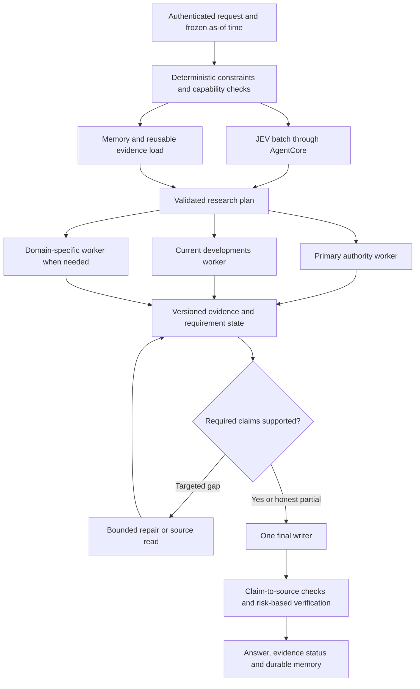

# Research chat orchestration: performance and accuracy review

Audit date: September 21, 2026. Portable external-agent handoff prepared from that audit. Source: `workingversion`, commit `f06e148fdda93553718621ab3634ce53548d7bfe`. This is a read-only application audit with offline synthetic probes. No AWS resources, live model calls, research providers, production data, or application code were changed.

The strongest improvement is to reduce redundant decisions, bound the entire dependency chain, and promote only validated evidence into the answer. Increasing model/tool concurrency before these changes can make the current failure modes faster and harder to diagnose. Keep Bedrock for reasoning and route all production JEV calls through AgentCore as specified below.

**Scope:** improve the active `runResearchAgent` Research chat path and its shared tools, routing, evidence and verification. **Frontier is legacy, retiring, and out of scope.** Its existence below is historical entry-point context, not an implementation target. Do not enable it, optimize it, or migrate active Research to it. No Frontier-only fixes or probe results are included in the active plan. This guide is an implementation brief, not a claim that the proposed fixes have shipped or permission to deploy.

All source citations are pinned to the audited commit. Re-check their current equivalents before implementing. The sole bundled evidence artifact is [synthetic-evidence.json](synthetic-evidence.json); it contains sanitized observations and provenance, no runnable machine-specific dependencies, credentials, private source text, or raw logs.

## 1. Current execution paths

**Source fact:** `/api/orchestrate` selects either `runResearchAgent` or `runFrontierAgent`. Frontier is off unless explicitly enabled. The checked-in runtime template does not set `FRONTIER_AGENT`; testing parameters do select TypeSafe for research effort and topic-shift routing. Live deployed settings remain unknown. [Entry selection](https://github.com/fshahersw/workingversion/blob/f06e148fdda93553718621ab3634ce53548d7bfe/src/routes/api/orchestrate.ts#L76), [flag default](https://github.com/fshahersw/workingversion/blob/f06e148fdda93553718621ab3634ce53548d7bfe/src/lib/agents/research-models.ts#L82), [testing intent](https://github.com/fshahersw/workingversion/blob/f06e148fdda93553718621ab3634ce53548d7bfe/infra/app/parameters/testing-runtime.parameters.json#L251).

Default loop:

```text
Request + memory ──┬── bounded user-profile load
                  └── effort classification
                         → clarification / follow-up resolution
                         → possible second effort classification
                         → speculative search alongside first model turn
                         → repeated model → parallel tool batch → barrier
                         → optional coverage audit and one extra round
                         → separate final synthesis
                         → optional report subagents, report drafting, file generation
                         → lexical/reference checks → done
                         → optional semantic judge → memory update
```

Fast currently allows four model steps / ten tool calls / a nominal 32-second loop budget; Think five / eighteen / 40 seconds. Reports expand to at least seven / twenty-six / 75 seconds. Those durations are **not hard end-to-end deadlines**. [Mode budgets](https://github.com/fshahersw/workingversion/blob/f06e148fdda93553718621ab3634ce53548d7bfe/src/lib/agents/research-agent.server.ts#L84), [report expansion](https://github.com/fshahersw/workingversion/blob/f06e148fdda93553718621ab3634ce53548d7bfe/src/lib/agents/research-agent.server.ts#L370).


Existing strengths worth retaining: parallel batches, in-flight request deduplication, speculative search using a separate source book, stable source references, bounded user-memory loading, recent verbatim context plus summaries, prompt-cache checkpoints, deterministic calculation tools, primary-source tools, explicit coverage repair, and streamed UI progress. The system needs consolidation and stronger boundaries, not a full rewrite.

## 2. Active Research findings ranked by implementation priority

| Priority | Finding and evidence | Why it matters / proposed correction |
| --- | --- | --- |
| P0 | Research's `streamOneTurn` defaults to `end_turn`, accumulates tool arguments and emits tool calls without requiring closed blocks and a valid tool-use completion. Tool dispatch does not gate on the stop reason. [Parser](https://github.com/fshahersw/workingversion/blob/f06e148fdda93553718621ab3634ce53548d7bfe/src/lib/agents/bedrock-stream-tools.server.ts#L217), [conversion](https://github.com/fshahersw/workingversion/blob/f06e148fdda93553718621ab3634ce53548d7bfe/src/lib/agents/bedrock-stream-tools.server.ts#L302), [dispatch](https://github.com/fshahersw/workingversion/blob/f06e148fdda93553718621ab3634ce53548d7bfe/src/lib/agents/bedrock-stream-tools.server.ts#L599). | Reuse the Office parser's proven completion checks in a shared protocol layer. Reject truncation, duplicate IDs, malformed JSON, missing stops, non-tool stops, disallowed names and invalid schemas before dispatch. Research also exposes Python/file generation, so invalid execution is more than a search-quality issue. |
| P0 | JEV effort policy can accept `conversational` even when its other answers say current information or a deliverable is needed. The adapter discards these flags before the no-tool short circuit. [Decision](https://github.com/fshahersw/workingversion/blob/f06e148fdda93553718621ab3634ce53548d7bfe/src/lib/agents/typesafe-questions.ts#L230), [adapter](https://github.com/fshahersw/workingversion/blob/f06e148fdda93553718621ab3634ce53548d7bfe/src/lib/agents/effort-router.server.ts#L44), [short circuit](https://github.com/fshahersw/workingversion/blob/f06e148fdda93553718621ab3634ce53548d7bfe/src/lib/agents/research-agent.server.ts#L263). | Return one complete typed route decision. Deterministically veto no-tool routing for fresh evidence, explicit artifact creation, unresolved references and domain-critical evidence needs. Confidence does not make mutually inconsistent answers safe. |
| P0 | Tool deadlines use `Promise.race` without cancelling the underlying call; the executor receives no signal. The nominal loop deadline is checked between turns, and synthesis is not bounded by it. [Timeout](https://github.com/fshahersw/workingversion/blob/f06e148fdda93553718621ab3634ce53548d7bfe/src/lib/agents/bedrock-stream-tools.server.ts#L613), [executor](https://github.com/fshahersw/workingversion/blob/f06e148fdda93553718621ab3634ce53548d7bfe/src/lib/agents/research-agent.server.ts#L599), [loop deadline](https://github.com/fshahersw/workingversion/blob/f06e148fdda93553718621ab3634ce53548d7bfe/src/lib/agents/bedrock-stream-tools.server.ts#L470). | Propagate a run deadline and linked abort signals through models, providers, body reads and retries. Isolate each tool's evidence and merge only an accepted result. Discard late completions. This prevents resource waste and evidence appearing after synthesis used a different snapshot. |
| P0 | Verification currently overstates what it proves: the deterministic checker tests a figure against the entire pooled corpus and does not extract ISO dates, while prompts request ISO dates. The semantic judge counts `NOT_ADDRESSED` in `supported`. [Fact checks](https://github.com/fshahersw/workingversion/blob/f06e148fdda93553718621ab3634ce53548d7bfe/src/lib/fact-check.ts#L25), [pooled match](https://github.com/fshahersw/workingversion/blob/f06e148fdda93553718621ab3634ce53548d7bfe/src/lib/fact-check.ts#L71), [judge aggregation](https://github.com/fshahersw/workingversion/blob/f06e148fdda93553718621ab3634ce53548d7bfe/src/lib/agents/faithfulness.server.ts#L228). | Verify each claim against its cited evidence span and version. Keep supported, contradicted, insufficient evidence and unchecked separate. Add normalized ISO dates, numeric units, party/court identity and pinpoint checks. Retrieval success is not claim entailment. |
| P1 | A refreshed source at an existing URL keeps the old snippet and metadata; only the longer verification shadow may change. [SourceBook](https://github.com/fshahersw/workingversion/blob/f06e148fdda93553718621ab3634ce53548d7bfe/src/lib/agents/tools.server.ts#L58). | Version source observations using content hash and retrieval time, keep stable display references, and bind each answer to a snapshot. Explicit refresh must update what the writer sees, while retaining the prior version for earlier answers. |
| P1 | All undated research web categories inherit a 30-day floor. Wider searches occur only after zero raw results. Publication date is stored as `effective_date`, and a title/date heuristic can mark a source current/superseded. [Window](https://github.com/fshahersw/workingversion/blob/f06e148fdda93553718621ab3634ce53548d7bfe/src/lib/agents/search-window.ts#L6), [default and relaxation](https://github.com/fshahersw/workingversion/blob/f06e148fdda93553718621ab3634ce53548d7bfe/src/lib/agents/tools.server.ts#L600), [source dates](https://github.com/fshahersw/workingversion/blob/f06e148fdda93553718621ab3634ce53548d7bfe/src/lib/agents/tools.server.ts#L875). | Separate current-status and historical/controlling-authority retrieval lanes. A recent article must not suppress an older controlling order. Distinguish event, publication, effective, retrieval and requested as-of dates; “not detected as superseded” must remain different from “verified current.” |
| P1 | Serial routing work precedes research; shadow mode also awaits JEV. A rewritten follow-up may be classified again. [Preflight](https://github.com/fshahersw/workingversion/blob/f06e148fdda93553718621ab3634ce53548d7bfe/src/lib/agents/research-agent.server.ts#L337), [shadow wait](https://github.com/fshahersw/workingversion/blob/f06e148fdda93553718621ab3634ce53548d7bfe/src/lib/agents/effort-router.server.ts#L53). | Run deterministic checks first, then one compact JEV batch in parallel with memory loading. Rewrite only genuinely unresolved references. Do not reclassify a semantically unchanged query. Shadow evaluation must not delay the selected path; in Lambda, use a supported durable telemetry path if it must outlive the request. |
| P1 | Report subagents run after the main digest. Search fans out at multiple levels and waits for every result; optional prefetch can add up to four seconds of waiting to a completed search. [Report workers](https://github.com/fshahersw/workingversion/blob/f06e148fdda93553718621ab3634ce53548d7bfe/src/lib/agents/research-agent.server.ts#L698), [provider barrier](https://github.com/fshahersw/workingversion/blob/f06e148fdda93553718621ab3634ce53548d7bfe/src/lib/agents/tools.server.ts#L688), [prefetch wait](https://github.com/fshahersw/workingversion/blob/f06e148fdda93553718621ab3634ce53548d7bfe/src/lib/agents/research-agent.server.ts#L623). | Start independent scoped research workers from the plan. Apply one shared concurrency budget across nested fan-out. Consume successful results incrementally, reserving time for required authoritative evidence. Optional prefetch should normally be nonblocking; never promote the fastest result merely because it arrived first. |
| P1 | A complete no-tool draft is usually discarded and another synthesis call writes the answer; the direct reuse path applies only to the first follow-up turn. [Duplicate synthesis](https://github.com/fshahersw/workingversion/blob/f06e148fdda93553718621ab3634ce53548d7bfe/src/lib/agents/bedrock-stream-tools.server.ts#L559). | Use an explicit research-complete handoff that does not ask the research model to draft a throwaway answer, or validate and reuse its completed draft when it is already the final writer model. Keep a single authoritative final answer, not two independent drafts. |
| P2 | Cache normalization lowercases every argument, including case-sensitive URL paths/query values. [Cache key](https://github.com/fshahersw/workingversion/blob/f06e148fdda93553718621ab3634ce53548d7bfe/src/lib/agents/run-state.server.ts#L118). | Use typed canonical keys, preserve case-sensitive data, bound cache entries/bytes, and scope private entries by principal and source version. |

These are source-backed behaviors and synthetic reproductions, not measured production failure frequencies. Provider latency, actual AWS configuration and model routing accuracy on real traffic remain unknown.

Additional confirmed boundaries:

- **Fast budget must not mean wrong tools.** The JEV rubric includes named docket status as a Fast example, but Fast removes all `db_*` tools. Keep a small authoritative docket lane available when the required fact demands it, even on a fast task. Hosted Fast also defaults to the same research model unless explicitly overridden, so the label is not proof of faster inference. [Rubric](https://github.com/fshahersw/workingversion/blob/f06e148fdda93553718621ab3634ce53548d7bfe/src/lib/agents/typesafe-questions.ts#L188), [tool filter](https://github.com/fshahersw/workingversion/blob/f06e148fdda93553718621ab3634ce53548d7bfe/src/lib/agents/research-agent.server.ts#L52), [model default](https://github.com/fshahersw/workingversion/blob/f06e148fdda93553718621ab3634ce53548d7bfe/src/lib/agents/research-models.ts#L48).
- **Routing input must preserve the actual request.** Effort state keeps only its first 3,000 characters. A synthetic request with its substantive requirement after that point loses the requirement. Send a bounded structured representation that preserves explicit trailing corrections and required actions; disallow low-effort/no-tool down-routing when material input was omitted. [State packing](https://github.com/fshahersw/workingversion/blob/f06e148fdda93553718621ab3634ce53548d7bfe/src/lib/agents/typesafe-questions.ts#L168).
- **An explicit mode does not protect against contradictory conversational routing today.** The no-tool branch accepts conversational confidence at least 0.9 even when the user requested Fast or Think. Carry the current-information and deliverable flags through the adapter and enforce them before this branch; do not merely tune confidence. [Mode override branch](https://github.com/fshahersw/workingversion/blob/f06e148fdda93553718621ab3634ce53548d7bfe/src/lib/agents/research-agent.server.ts#L267).
- **Do not mistake document routing for chat routing.** `router.server.ts` routes document-summary sections and is called by `summarizer.server.ts`; it is not the Research chat entry router. Work on the effort/topic-shift path for this task. [Summarizer caller](https://github.com/fshahersw/workingversion/blob/f06e148fdda93553718621ab3634ce53548d7bfe/src/lib/agents/summarizer.server.ts#L792).

## 3. Proposed orchestration



This is a dependency graph, not an instruction to launch three workers for every request. A narrow lookup should use one direct source/tool lane. A broad matter overview can use three independent lanes; a historical doctrine question needs primary authority and contradictory authority, not necessarily a current-news sweep. Reuse existing clients and sources.

Suggested plan contract: `runId`, `conversationId`, principal-scoped evidence handle, normalized request, jurisdiction/matter, frozen `asOf`, timezone, freshness policy, required propositions, available tools, dependency edges, concurrency quotas, stage deadlines, output format and verification policy. Every tool result carries status, provenance/version, elapsed time, error class and accepted evidence/typed output. Results are immutable after acceptance.

Use a requirement-to-evidence ledger. A requirement is satisfied by evidence that actually addresses it, with jurisdiction, date and authority checked. A source count or “two primary sources” is not entailment. Track `missing`, `supported`, `contradicted`, `insufficient`, `unavailable` and `superseded`; a conflict is not automatically a successfully resolved conclusion.

## 4. JEV placement and exact responsibilities

Follow the requested boundary: application IAM role → SigV4 AgentCore Gateway → narrow Lambda adapter → TypeSafe. The vendor remains external; use compact approved task state. Production must not call TypeSafe directly or fall back to a direct vendor call. Keep the TypeSafe secret solely in the adapter; the application authenticates to the gateway with its AWS role. AWS documents the supported [Lambda target](https://docs.aws.amazon.com/bedrock-agentcore/latest/devguide/gateway-add-target-lambda.html) architecture.

Use one batched request for independently useful decisions: task class, freshness requirement, historical/as-of requirement, context dependence/topic continuity, requested deliverable, legal/medical risk, and source families. Start with existing heads and add only those validated on the benchmark. A later state-change batch can label remaining gap types or escalation needs; do not pay another routing call on every unchanged round. TypeSafe explicitly supports [multiple independent questions in one call](https://docs.typesafe.ai/patterns/fan-out).

Code then enforces invariants: current facts require evidence; file requests require an artifact path; a required tool needs a positive execution budget; known legal-risk gates cannot be down-routed by a contradictory answer; source availability is read from configuration, not guessed. Uncertain or invalid results choose the conservative reasoning path. JEV never authorizes access, invents search queries/arguments as freeform generation, establishes legal support, or performs arithmetic/date comparison. Its own [limitations](https://docs.typesafe.ai/model-jaggedness/jev-1.13) recommend code for numbers/dates and invariants; [confidence](https://docs.typesafe.ai/confidence) is a distribution statistic, not a correctness guarantee.

Keep the current 800 ms client budget as the initial *evaluation setting*, including signing, gateway, adapter, vendor and parsing. Do not promise it will perform well through AgentCore until cold/warm distributions are measured. Zero critical-path retries; bounded cache keyed by model/rubric/context/freshness/config/transport. Never let a stale route cache suppress an explicit refresh or changed as-of date.

### Initial batch matching the current contract

| Head | Type | Policy use |
| --- | --- | --- |
| `effort` | Choice: conversational / fast / think | Advisory work budget, subordinate to deterministic vetoes. |
| `wants_deliverable` | Noul | Explicit artifact work forbids a conversational shortcut. |
| `legal_subject` | Noul | Combine with deterministic legal-risk checks; never treat low probability as proof of safety. |
| `needs_current_info` | Noul | Fresh facts require evidence retrieval or an explicit unavailable outcome. |
| `needs_primary_case_record` | Proposed Noul | Retain permitted case/docket/filing tools independently of Fast/Think. |
| `needs_context_resolution` | Proposed Noul | Invoke a generative resolver only for genuinely unresolved references. |
| `topic_shift` | Proposed Noul in shared batch | Applies only when prior subject context exists. |

The first four heads already exist; the final three are a proposed combined contract, not deployed behavior. Use complete current instructions plus bounded grounded matter/entities, prior answer context, attachment metadata, explicit user mode, clarification selections and a frozen date. Preserve corrections at the end of long requests. When material input cannot fit, select a conservative route rather than classifying a misleading prefix. If mixed source-family heads are added, use independent questions rather than one mutually exclusive family choice. Code decides which authorized tools can run. JEV does not generate query rewrites, tool arguments, legal conclusions, dates or arithmetic.

### AgentCore adapter implementation boundary

At the audited commit, [typesafe.server.ts](https://github.com/fshahersw/workingversion/blob/f06e148fdda93553718621ab3634ce53548d7bfe/src/lib/agents/typesafe.server.ts#L183) still calls TypeSafe directly. Changing only the routing rubric does not implement the required production boundary.

1. Add a bounded Gateway transport behind the existing typed client contract. Use the application's AWS role with SigV4 and the configured Gateway tool identifier; never place a vendor key in browser payloads or the app's production environment. Reuse signing patterns from [agentcore-search.server.ts](../../../src/lib/agents/agentcore-search.server.ts), after checking its actual contract.
2. Expose one narrowly scoped Lambda tool adapter for the decision batch. Validate input bounds and allowed model/question types, call the fixed TypeSafe endpoint, and return validated JSON. Store its secret only in Secrets Manager with adapter-only access. Scope Gateway invocation and Lambda permissions to exact resources. An arbitrary caller-selected URL is not part of this contract.
3. Preserve the existing finite typed-answer, question-matching and model checks. Apply a caller deadline across signing, Gateway, adapter, vendor and body parsing; independently bound adapter execution because client abort may not cancel remote Lambda work. No direct TypeSafe fallback in production. Gateway unavailable, malformed response, disagreement or timeout selects the safe deterministic/main route.
4. Test IAM denial, wrong tool identity, malformed/model-mismatched results, timeout/abort, late completion, secret redaction, private-context isolation and zero direct vendor traffic from the application. Measure cold/warm end-to-end Gateway latency separately from vendor latency before setting release targets.

AWS documents [inbound authentication](https://docs.aws.amazon.com/bedrock-agentcore/latest/devguide/gateway-inbound-auth.html) and [Lambda targets](https://docs.aws.amazon.com/bedrock-agentcore/latest/devguide/gateway-add-target-lambda.html). Verify the deployed protocol version/tool name and current API contract during implementation. Gateway mediation governs access; TypeSafe inference remains outside AWS. Document and minimize the exact task context sent to that external service.

## 5. Parallel rounds and low latency

1. Start safe deterministic work and memory I/O together. Known greetings can bypass classification; fresh fact requests cannot. Resolve references only when needed.
2. Start a small number of independently scoped workers early, with compact briefs and shared source identifiers. Give each a distinct requirement set and stopping rule; do not send the entire conversation to every worker.
3. Bound **aggregate** tool concurrency, including categories, query variants, providers, embeddings, page reads, subagents and verification. As initial benchmark settings, try eight external requests globally and lower per-provider caps, with two or three model workers. These are tunable starting points, not measured optima.
4. Prefer structured primary APIs for structured facts and direct document reads for known URLs/IDs. Restrict a short first retrieval wave to likely source families; expand when coverage or relevance is insufficient. Stop optional duplicate searches once requirements are satisfied.
5. When a provider fails, distinguish unavailable from no results. Do not cache an outage as authoritative empty evidence. Hedge another already integrated provider only for a measured slow/failing request; avoid multiplying every query by every provider.
6. Keep protocol tool-use groups well formed: accepted calls receive exactly one terminal result. Cancel or mark a bounded timeout for stragglers before advancing the model; do not append a late result to an already consumed model turn.
7. Reserve time for required source reads and synthesis. A loop deadline must cover in-flight requests and response bodies. When a substantial task cannot finish within the interactive budget, checkpoint an honest partial result and use a resumable durable job instead of leaving an unbounded SSE request.
8. Remove throwaway drafts and unnecessary planner calls. Keep generous *maximum* output capacity where reasoning shares the token budget; reducing it indiscriminately risks empty/truncated answers. Use task-appropriate effort and actual output length targets.
9. Keep stable tool/system prefixes cacheable and put changing task/time/evidence content after them. The current code already sends cache points; measure cache reads/writes before claiming a benefit. AWS [prompt caching](https://docs.aws.amazon.com/bedrock/latest/userguide/prompt-caching.html) support and limits vary by model/API.
10. Evaluate model/region-specific performance settings only after removing orchestration waste. AWS [latency-optimized inference](https://docs.aws.amazon.com/bedrock/latest/userguide/latency-optimized-inference.html) is not a universal switch for every configured model. Validate supported model/profile, region, quotas and actual served performance; preserve a strong reasoning/writer lane.

## 6. Context and temporal accuracy

Use three context layers: stable instructions/tool contracts; a compact task state with user constraints and unresolved requirements; query-relevant evidence spans. Keep full documents in a scoped evidence store with content hashes and retrievable offsets. Native calculations and mechanical extraction should return typed results, not inflate every model context with execution logs.

Compact on a measured token budget and requirement boundary. Preserve exact latest user instructions, clarifications, current matter/jurisdiction, as-of date, primary identifiers, unresolved contradictions, failed searches and verified citations. Label user claims, retrieved claims and assistant hypotheses separately. Memory summaries must not promote an unverified previous answer into an established fact. Restore relevant spans on demand rather than relying on a 300-character prefix.

Freeze `now` once per run and propagate it. Distinguish requested as-of date, source publication time, event date, effective interval, retrieval time and court timezone. Historical questions exclude later developments except clearly labeled retrospective context. “Next hearing” requires a future event in the relevant court timezone, linked to its scheduling authority, plus an explicit check for later changes. An older order can remain controlling; a newer article is not itself a superseding order.

Freshness policy should depend on the fact: calendars/posture get short validation windows and refresh on demand; historical authority is reusable by immutable version. Reopened conversations must not treat weeks-old snippets as current merely because they still have an `[S#]` reference. Keep separate historical and current retrieval lanes with explicit date filters rather than a universal last-30-days policy.

## 7. Verification without a slow extra full-answer pass

Run low-cost source/reference/date/number checks while evidence arrives. Judge narrow high-risk claims against exact cited spans, with bounded parallelism. Before finalizing current legal status, controlling holdings, schedules, deadlines and material figures, require enough evidence or explicitly mark the answer partial. Peripheral checks can arrive later, but the UI and persisted memory must not say “verified” while material checks are unresolved.

The existing late faithfulness pass can remain for additional auditing, but distinguish it from a pre-release quality gate. Separate `answer_ready`, `verification_pending`, `verified`, `partial`, `cancelled` and `failed`. Corrections must update the answer/claim and its memory provenance, not merely add an unsupported-count badge after a confident statement has been saved.

Do not add new research providers in this optimization pass. The task is to use and verify existing tools more effectively.

## 8. Validation evidence and measurement contract

Recorded audit validation: **249 passed, zero failed, 36 files** using `bun test src/lib/agents src/lib/research-intent.test.ts src/lib/fact-check.test.ts`. An initial attempt failed four Office extraction tests because `python` was not on PATH; adding the bundled Python runtime resolved them without application changes. This is historical audit evidence, not a fresh run at the handoff commit. Raw logs are intentionally omitted from this portable guide.

The compact [synthetic evidence record](synthetic-evidence.json) preserves active-path observations and provenance. Original probes used synthetic data, mocked transports, or isolated actual functions/classes. They demonstrate reachable code behavior, not live model error frequency, AWS latency, or end-to-end answer quality. Machine-specific probe launchers and raw logs are not included; implement portable regression tests beside the affected source modules.

Observed active-path probe results: three incomplete-stream cases still dispatched a tool; contradictory JEV heads permitted a conversational route; a 3,063-character request lost its substantive suffix; an existing-source refresh retained old visible text/date; ISO-date extraction missed the requested date format; a wrong-source amount passed the pooled checker; `NOT_ADDRESSED` counted as supported; case-sensitive URLs collided in the cache. These are reproductions of incorrect behavior, not passing product correctness tests. Frontier-only probes and conclusions are excluded from this active plan.

Instrument a consistent event schema across the active Research stages: `runId`, `conversationId`, `parentSpanId`, `spanId`, tool-call ID, stage, provider/model/config identity, deadline remaining, duration, cache read/write/hit, outcome and sanitized error class. Record time to first useful evidence, first answer token, answer-ready, material-verification-complete and memory-commit. Preserve query/source content outside ordinary logs; the current logger truncates but does not redact text. Do not mistake a fast `done` event for a fast verified answer.

Benchmark with a held-out synthetic suite: greeting; fixed fact; current federal/state posture; historical/as-of analysis; ambiguous follow-up; uploaded-doc-only request; conflicting orders; financial calculation; broad report; provider failure; timeout/cancel; repeated long conversation; malicious instructions in a retrieved source. Include cold/warm and concurrent-user runs on the real AWS path. Compare p50/p95/p99, tool/model calls, cache rates, context size, required-question coverage, citation entailment, temporal accuracy and correct abstention.

Proposed release criteria, to validate rather than claim: zero execution of incomplete model tools; zero accepted late-result mutations after cancellation; zero false no-research routes in mandatory freshness/deliverable cases; no `NOT_ADDRESSED` counted as supported; no loss of mandatory user constraints; verified-answer quality no worse than baseline with materially lower p95 latency and fewer redundant calls. Set numeric latency targets after the first AWS baseline; promising a sub-second thorough legal research answer now would be unsupported.

## 9. Implementation order for the external agent

1. Shared model-stream completion validator, real cancellation/deadline propagation, immutable tool results, typed route invariants, and verification status fixes. Add the reproduced failures as regressions.
2. Source observation versioning, temporal policy, case-safe cache keys and shared trace schema. Establish an AWS baseline when environment access is available.
3. AgentCore-mediated batched JEV routing with one decision contract; remove repeated serial classification and preserve deterministic vetoes.
4. Early scoped workers, dependency-aware bounded scheduling, incremental evidence assembly, and selective query expansion. Eliminate discard-and-rewrite synthesis.
5. Requirement-driven context packing, targeted claim verification and resumable long jobs. Validate every changed path against the held-out suite and real Bedrock/tool transport before rollout.

For each stage, first reproduce the affected active-path behavior with fixed fixtures, then add assertions for the corrected outcome. Keep changes reviewable; do not use broad refactoring as a prerequisite. The minimum regression groups are:

| Work | Required regression evidence |
| --- | --- |
| Stream execution | Actual framed Bedrock events: truncated EOF, unclosed blocks, invalid JSON, duplicate IDs, `max_tokens`, wrong terminal reason, disallowed names, schema mismatch and cancellation before dispatch. Assert zero tool execution for invalid proposals and valid follow-up protocol for accepted calls. |
| Routing | Contradictory heads, forced Fast/Think, current facts, artifact requests, named docket lookup, complex suffix after a long prefix, mixed legal work, attachments and unresolved follow-ups. Assert mandatory evidence/tools survive every cheap-route proposal. |
| Deadlines | Controlled slow tools and bodies; assert physical active-call bounds, no new scheduling after deadline, no accepted late-source mutations, and no automatic replay of non-idempotent work. |
| Evidence and verification | Same-URL changed content, exact cited-span checks, wrong-source numbers, ISO dates, historical/current orders, unsupported and NOT_ADDRESSED judge results, and case-sensitive URL cache keys. |
| Performance and recovery | Serial preflight versus batched route, duplicate synthesis, nested fan-out caps, provider failures, partial workers, cancellation, resumable work and shared-cache isolation. Measure supported-answer quality alongside latency. |

Run the existing test command in section 8 after focused regressions; ensure Python is available for extraction tests. Add adapter/transport tests to the relevant suite, run the repository's required type/build checks, and record the exact new commit and environment. Existing audit passes do not validate new code. Live acceptance must exercise the **original production Bedrock path**, authorized research providers and AgentCore-mediated JEV, not temporary direct-model adapters. Record actual model/config identifiers and leave untested AWS/model access explicitly outstanding.

Implement on a new reviewable branch from the delivered checkpoint. Re-check current source before changing it: findings are pinned to the audited commit and may be fixed later. Keep the active Research entry on `runResearchAgent`. Frontier is retiring and out of scope: do not enable, optimize, expand, or migrate execution to it. Do not change production models solely from source inspection. Validate changes on the real Bedrock and tool transport before rollout, with explicit authorization for any deployment.
