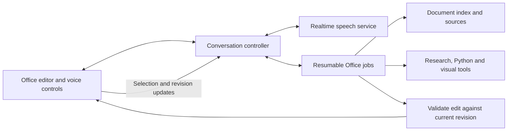

# Office agent upgrade assessment

Assessment date: September 12, 2026. Subject: the real Seeger Weiss platform's Writer, Sheets, and Slides. Local checkout: `workingversion-discovery-review`, branch `codex/discovery-reliability-graph`, base `74f53064ec7e82732f11027d4e01f6ff6b2e1173` with existing Discovery changes preserved.

This is a code inspection and research deliverable. The improvements below are proposals, not implemented features. No Office runtime code, credentials, production resources, or deployment configuration changed during this assessment. Live model latency, provider availability, and document fidelity were not benchmarked. The findings describe this local checkout; deployment parity has not been established.

The best next investment is a shared Office execution layer that combines precise document operations, durable source context, resumable work, and immediate conversation. The platform already has many of the necessary tools. Reliability and coordination should improve before adding a large new tool catalog.

## Existing capabilities to preserve

| Area                        | Evidence in the checkout                                                                                                 | Implication                                                                                                                                                                                                                                       |
| --------------------------- | ------------------------------------------------------------------------------------------------------------------------ | ------------------------------------------------------------------------------------------------------------------------------------------------------------------------------------------------------------------------------------------------- |
| Shared agent loop           | `src/writer/packages/agent-core/src/loop.ts`                                                                             | Reuses conversation history, retries empty streams, guards repeated failures, supports snapshots and concurrent read-only tools. Extend this contract rather than replacing each editor separately.                                               |
| Streaming and model routing | `src/lib/office/stream.server.ts`; `src/lib/writer/inference.server.ts`                                                  | Authenticated SSE, cancellation, prompt caching, fast/main routing, token and first-response metrics already exist. A routed request can involve an additional classification call with a four-second timeout; actual overhead needs measurement. |
| Save correctness            | `src/lib/office/office.server.ts`; `src/writer/platform/adapter.ts`                                                      | Versioned saves, conditional writes, idempotency keys, recovery copies, and immutable revisions already exist. A background agent must reuse them.                                                                                                |
| Writer editing              | `src/writer/renderer/ai/tools.ts`; `commands.ts`; `docs-skill.ts`                                                        | Block readers, restricted HTML edits, command transactions, frozen selection, stale-document checks, comments, tracked revisions, native charts and tables.                                                                                       |
| Sheets intelligence         | `src/office/sheets/src/renderer/ai/workbook-search.ts`; `formula-audit.ts`; `workbook-readers.ts`                        | Search, lazy readers, formula precedents/dependents, aggregations, formats and feature inspection already exist. Workbook search includes explicit scan limits and incomplete results.                                                            |
| Slides editing              | `src/office/slides/src/renderer/ai/sw-skill.ts`; `layout-audit.ts`; `slide-qc.ts`                                        | Native templates and editable operations, geometry audits, and a visual QC helper exist. Some upstream HTML deck generation tools are deliberately disabled in this platform build; their presence in source does not establish availability.     |
| Research and computation    | `src/office/shared/platform-skill.ts`; `src/lib/office/tools.server.ts`                                                  | Python, Graphviz, Mermaid, web/page reads, citation lookup, firm knowledge, templates, image generation/editing, and cross-app document creation are wired into the shared capability layer. Live provider configuration remains separate.        |
| Dictation                   | `src/office/shared/DictationButton.tsx`; `src/writer/renderer/ai/useDictation.ts`; `src/lib/agents/transcribe.server.ts` | Records a clip, then transcribes it. This is not a continuing speech-to-speech conversation.                                                                                                                                                      |

## Concrete findings and first fixes

| Priority     | Observed implementation                                                                                                                                                                                                                                                                    | Practical effect                                                                                                                                                                                                                         | Proposed change                                                                                                                                                                                                                                                                                                                                          |
| ------------ | ------------------------------------------------------------------------------------------------------------------------------------------------------------------------------------------------------------------------------------------------------------------------------------------ | ---------------------------------------------------------------------------------------------------------------------------------------------------------------------------------------------------------------------------------------- | -------------------------------------------------------------------------------------------------------------------------------------------------------------------------------------------------------------------------------------------------------------------------------------------------------------------------------------------------------- |
| First        | `src/lib/agents/code-interpreter.server.ts:56` holds a module-level session; execution preserves Python context and files. `src/lib/office/tools.functions.ts:20` authenticates Python calls but does not pass the user's identity into the interpreter. Artifact tracking is also global. | Different requests handled by the same process can reuse computation state and files. This is a code-level isolation risk, not an observed production incident. Increasing parallelism without addressing it would amplify interference. | Bind interpreter sessions and artifact manifests to authenticated principal + authorized workspace/document set + run. Serialize operations sharing a sandbox. Use distinct sandboxes for independent jobs, per-run paths, cancellation, expiry and cleanup. Audit every caller of the shared interpreter, including attachment extraction and research. |
| First        | `src/writer/renderer/ai/commands.ts:685` searches each direct text child separately.                                                                                                                                                                                                       | A search phrase spanning multiple formatting runs, such as normal text followed by a bold word, cannot match as a whole. Nested content needs explicit handling too.                                                                     | Build a visible-text-to-editor-position map within each supported text block, respecting tracked deletions and protected content. Locate a full phrase across runs, preserve unaffected marks, report occurrences, and reject ambiguous singular edits.                                                                                                  |
| First        | `src/writer/renderer/ai/protocol.ts:505` shrinks the document outline to a 24,000-character budget and then removes middle entries. It even suggests extrapolating indexes.                                                                                                                | The initial context does not guarantee visibility of a long document's middle. Reading tools can recover it, but coverage depends on the model's choices.                                                                                | Keep a complete paginated outline and stable block identifiers. Add structural and lexical search, section reads, and a coverage-aware full-document scan. Remove instructions to extrapolate unseen targets.                                                                                                                                            |
| First        | `src/lib/office/attachments.server.ts:32` caps extracted text at 2,000,000 characters; extraction paths slice the text before returning `ready`. Input attachments are limited to 25 MB.                                                                                                   | A large attachment can appear ready even though only a prefix is accessible. Raising model context alone will not restore missing source text.                                                                                           | Persist complete extraction in chunks, with a manifest of page/section counts and extraction failures. Return handles and cursors rather than the entire extraction. Display partial status when a limit is reached. Larger uploads should use resumable object uploads and background extraction.                                                       |
| First        | `src/lib/writer/web-search.server.ts:85` applies a `2000-01-01` publication cutoff for ordinary searches; shared research also adds current-date variants for some categories.                                                                                                             | Historical legal authority can be excluded or deprioritized.                                                                                                                                                                             | Add explicit authority, historical, and recent-development search purposes. Authority lookup should have no arbitrary lower date limit; preserve dates when the user requests them. Keep these changes scoped to Office requests so unrelated research behavior is not silently changed.                                                                 |
| Next         | `src/writer/packages/agent-core/src/loop.ts:83` uses byte-based history budgets; `:494` truncates older tool outputs to 8,000 characters when over budget. Summaries retain only a compressed account.                                                                                     | Early evidence can disappear from active context. Bytes are not a reliable substitute for a model's total input/output token allowance.                                                                                                  | Use model-aware token budgets, source handles, explicit outstanding tasks, and a durable evidence ledger. Persist full tool results outside chat and reread by handle. Summaries should link to evidence, never replace the only evidence copy.                                                                                                          |
| Next         | `src/lib/office/tools.server.ts:569` verifies reporter-citation lookup matches.                                                                                                                                                                                                            | A matching case identifier does not establish that a proposition, quotation, pinpoint, or treatment claim is supported.                                                                                                                  | Separate statuses: citation found; quotation matched; pinpoint checked; proposition reviewed; treatment not checked/checked by an available licensed source. Preserve unresolved statuses.                                                                                                                                                               |
| Next         | `src/office/shared/platform-skill.ts:621` renders diagrams into image handles. Mermaid returns SVG, but this path stores the PNG without its editable source specification.                                                                                                                | Later edits often require regeneration, and the inserted image has weak structured provenance.                                                                                                                                           | Store the original specification, renderer/version, theme, data, source references and output versions alongside SVG/PNG. Allow reopening and editing the diagram. Native Office shapes/charts need a separate conversion path where supported.                                                                                                          |
| Architecture | The Office model endpoint serves one turn; the browser owns the multi-turn tool loop. Writer ignores new sends while the loop is busy.                                                                                                                                                     | A continuing voice conversation cannot simply share the existing busy composer. A browser-owned job is not durable background execution.                                                                                                 | Introduce an independent conversation controller and resumable Office jobs. Keep editor mutations coordinated through the existing document/version contracts.                                                                                                                                                                                           |

## Document context and accurate edits

Create an incremental document map keyed by content hash and saved revision. Include headings, paragraphs, table/cell coordinates, footnotes/endnotes, comments, tracked changes, figures, slide notes, sheet ranges, formula dependencies, exhibits and source references. An OOXML-aware representation should remain authoritative for Office edits; OCR or flattened Markdown should not replace it.

Use three context levels: a compact global map; the user's active selection and surrounding section; and on-demand original source passages. Combine exact/keyword search with semantic retrieval for questions. Use a separate full-scope scan for instructions such as “every,” “all,” “throughout,” or “compare the entire agreement.” Ranked retrieval alone cannot establish an exhaustive result.

Every scan should record intended scope, visited chunks/pages, extraction gaps, failed work, retries, and unresolved findings. Negative claims must be qualified when coverage is partial. Update only changed index sections after an edit. Cache by document revision and request parameters, and invalidate stale results.

Define precise edit requests with document ID, base revision, stable target ID, expected original content or hash, the requested operation, and postconditions. A formatting change should preserve all text. A replacement should preserve unrelated numbering, quotations, cross-references and comments. A numeric change should update dependent formulas or flag them for review. Apply operations in a transaction and verify actual results before describing success.

Retain current direct-edit and Undo behavior for ordinary requested edits. Provide an optional Review changes mode, focused diffs, and clear conflicts when the user edits a target while the agent is working. A check should not be represented as completed merely because a tool returned without throwing.

## Small research tasks and sources

Add scoped research actions such as “find the original source for this claim,” “check this quotation,” “update this figure,” and “find contrary authority.” Each should return an evidence object with source URL/document ID, retrieval time, source version, exact passage, locator, claim supported, and any limitation.

Read the actual source beyond a search snippet. Support fetching more of a long source by cursor or section; the current page tool reports a truncated prefix but has no continuation argument. Store original fetched text separately from model summaries. Sources found only by title or citation identity must remain distinguishable from sources read and substantively checked.

Public search queries should contain the minimum necessary public terms; selected internal text must not automatically become a web query. Enforce workspace/source permissions in every retrieval tool. Documents and fetched pages are evidence, not instructions to change tool access or workflow policy.

Useful Office workflows include a brief's authority/quotation audit, a record-supported chronology with clickable exhibits, a source-to-spreadsheet damages schedule, an expert-report claim/evidence matrix, a firm-style document cleanup, and a hearing deck whose factual statements link back to source passages. Each workflow should use typed outputs and report missing support.

## Open-source tools worth integrating

The following shortlist is based on current primary repositories, not a claim to enumerate every available project. License descriptions concern the cited core code; dependencies, fonts, assets, models and hosted offerings can have separate terms. Hosting and model inference still have costs.

| Tool                                                      | Core license                                                                | Best fit in this platform                                                                                                           | Integration recommendation                                                                                                                                                                                                                                    |
| --------------------------------------------------------- | --------------------------------------------------------------------------- | ----------------------------------------------------------------------------------------------------------------------------------- | ------------------------------------------------------------------------------------------------------------------------------------------------------------------------------------------------------------------------------------------------------------- |
| [Mermaid](https://github.com/mermaid-js/mermaid)          | MIT                                                                         | Flowcharts, timelines, sequence and relationship diagrams from text.                                                                | Already present. Preserve source and SVG, add firm themes, and support editing the existing artifact.                                                                                                                                                         |
| [AntV Infographic](https://github.com/antvis/Infographic) | MIT                                                                         | Styled process maps, comparisons and compact explanatory infographics. The repository provides templates, SVG output and an editor. | Strongest new visual addition to prototype. Use a curated template subset with controlled typography and source-backed data. Keep it optional and lazily loaded.                                                                                              |
| [Vega-Lite](https://github.com/vega/vega-lite)            | [BSD 3-clause](https://github.com/vega/vega-lite/blob/main/LICENSE)         | Declarative analytical graphics tied to structured data.                                                                            | Use for more advanced plots than native Office charts support. Retain data/specification and add a table alternative. Validate data and units before rendering.                                                                                               |
| [Apache ECharts](https://github.com/apache/echarts)       | Apache-2.0                                                                  | Rich interactive charts and large exploratory dashboards.                                                                           | An alternative to Vega-Lite for interaction-heavy views, not a reason to install both immediately. Preserve native editable Office charts for routine bar/line/pie work.                                                                                      |
| [Excalidraw](https://github.com/excalidraw/excalidraw)    | [MIT](https://github.com/excalidraw/excalidraw/blob/master/LICENSE)         | User-adjustable strategy boards and diagrams.                                                                                       | Optional visual editing canvas. Choose deliberate firm styling; do not make the hand-drawn aesthetic the default for formal filings.                                                                                                                          |
| [Docling](https://github.com/docling-project/docling)     | MIT code; individual models have their own licenses                         | Layout/reading-order/table-aware extraction and local processing across formats.                                                    | Benchmark as an extraction sidecar/fallback against the existing native/BDA route on representative difficult files. Preserve page coordinates and compare errors. Do not assume better accuracy on every file or use it to rewrite original Office packages. |
| [eyecite](https://github.com/freelawproject/eyecite)      | [BSD 2-clause](https://github.com/freelawproject/eyecite/blob/main/LICENSE) | Identifying and normalizing legal citations before lookup.                                                                          | Add as a deterministic parsing step. It is not a complete Bluebook, holding, or negative-treatment validator.                                                                                                                                                 |
| [LiveKit Agents](https://github.com/livekit/agents)       | Apache-2.0 framework; turn detection models use a separate license          | Realtime conversation transport and orchestration with WebRTC clients.                                                              | Evaluate for browser audio reliability if a direct AWS bridge is insufficient. The cloud service and model providers are separate from the open-source framework.                                                                                             |
| [Pipecat](https://github.com/pipecat-ai/pipecat)          | BSD 2-clause                                                                | Python-based streaming voice pipelines.                                                                                             | Alternative to LiveKit's agent framework when a Python voice service better fits the deployment. Choose one primary orchestration path.                                                                                                                       |

Expose these through a small shared visual contract: create, preview, validate, insert, edit, and export. The model chooses a constrained visual specification; the renderer computes layout. Store every label and plotted value with its provenance. A case chronology or financial chart should not depend on a generative image model spelling the labels and inventing geometry correctly.

Before insertion, run syntax/schema validation, text overflow and clipping checks, contrast/minimum-type checks, numeric consistency checks, and a render inspection for complicated output. Preserve original coordinates and editable native parts where supported. SVG editability is not the same as native Word/PowerPoint shape editability; the UI must make that distinction clear.

## Continuous voice with background Office work

For the current AWS direction, Amazon Nova 2 Sonic is a credible candidate for a prototype. AWS documents [asynchronous tool calling](https://docs.aws.amazon.com/nova/latest/nova2-userguide/sonic-tool-configuration.html), so the voice model can continue the conversation while a tool works. It also documents [interruption handling](https://docs.aws.amazon.com/nova/latest/nova2-userguide/sonic-barge-in.html); the browser must stop playback and discard queued audio when interrupted.

An open conversation must survive transport renewal. AWS's [getting-started guide](https://docs.aws.amazon.com/nova/latest/nova2-userguide/sonic-getting-started.html) specifies an eight-minute connection limit and links a renewal/continuation example. “Stay open until closed” should mean a persistent application session with renewed provider connections, not one infinite socket. Actual latency and transcription of names, citations and numbers require testing.

The controller knows the active document, selection, slide/range, revision, named job and recent verified actions. It can answer quick questions, accept a correction, show a source, pause or cancel work, and report actual progress. Deep drafting and analysis use the existing capable text/tool model separately. Tool completion events carry the job ID and revision so stale results are not announced or applied to the wrong document.

Example: the user says, “Build a chronology from these exhibits.” The agent starts a source scan. The user continues, “Only include events before the recall, and flag disputed dates.” The controller updates the job scope at a safe boundary and immediately acknowledges the change. The UI shows covered sources, unresolved dates and the proposed chronology. Any edit is applied only if its target version is still valid.

The voice UI should have explicit Off, Connecting, Listening, Speaking, Reconnecting and Muted states; editable live transcripts; visible active jobs; and accessible keyboard equivalents. Interrupting speech should not silently cancel a long job. “Cancel that task” should cancel the named job and prevent later mutations. Closing voice must release the microphone and audio connection; task continuation should remain visible and controllable independently.

Only finalized, validated instructions should initiate mutations; partial speech hypotheses must not cause edits. Numerical values, party names and ambiguous targets should be reflected in visible instructions and clarified when needed. Keep raw-audio retention off by default, with policy-controlled transcript storage and no raw audio or document contents in infrastructure logs.

Run the voice bridge on infrastructure that supports the chosen persistent audio transport. The existing one-turn SSE endpoint is not itself a bidirectional audio service. Keep AWS signing and credentials server-side. See AWS [code examples](https://docs.aws.amazon.com/nova/latest/nova2-userguide/sonic-code-examples.html) and [integration patterns](https://docs.aws.amazon.com/nova/latest/nova2-userguide/sonic-integrations.html).

## Execution and performance

Measure first visible response, first meaningful tool result, completion time, recovery time, and editor responsiveness separately. Immediate acknowledgement is useful, but it must not conceal a stalled job. Existing Office metrics are a good starting point.

Route deterministic formatting and arithmetic directly through validated operations where possible. Use the capable model for substantive drafting, ambiguous edits and source reasoning; retry or escalate based on validation failures rather than silently repeating an ineffective plan. Keep model choices configurable and evaluate against real Office tasks instead of treating a model-name upgrade as proof of quality.

Read-only calls already run concurrently. Add bounded, dependency-aware scheduling with separate limits for search, OCR, rendering and model calls. Two operations sharing mutable Python state must not run concurrently without isolation. Writes to one document remain serialized. Retry transient read failures with backoff; mutations require operation IDs and replay checks. Cancellation must propagate through every long-running tool.

Move expensive parsing, indexing and rendering out of the editor's main thread where feasible. Use lazy component loading, virtualized outlines and range readers. Cache extraction and summaries by revision, retain full-source access, and expose progress as soon as useful sections are available. Returning artifact handles is preferable to repeatedly putting large base64 files into model history.

Persist job plans, input versions, source references, completed operations, artifacts, validation results and remaining work. A page reload should reconnect to the job, not restart edits. For browser-only editors, background jobs can prepare a validated patch; applying it still requires a compatible editor/document state. Full server-side native editing needs an explicit tested headless adapter and must not be assumed from current browser tool availability.

AWS's [Code Interpreter session documentation](https://docs.aws.amazon.com/bedrock-agentcore/latest/devguide/code-interpreter-session-characteristics.html) describes isolated, stateful sessions. The application must select the right session for the right principal/run. Reusing one process-wide session defeats that application boundary even when the provider isolates separate sessions correctly.

## Suggested delivery order and proof

| Increment                  | User-visible result                                                                                                             | Acceptance evidence                                                                                                                                                                                 |
| -------------------------- | ------------------------------------------------------------------------------------------------------------------------------- | --------------------------------------------------------------------------------------------------------------------------------------------------------------------------------------------------- |
| 1. Precision and coverage  | Reliable phrase edits, clear scan scope, historical authority search, isolated computation, truthful partial/extraction status. | Phrases split across marks; tracked deletions; nested tables; simultaneous users/runs; source beyond the extraction cap; relevant material only in a long document's middle; old authority queries. |
| 2. Document intelligence   | Incremental document map, source panel, claim/quote checks, continuation reads, reusable source-backed workflows.               | Full-scope scans cover the manifest; partial scans cannot claim completeness; edit invalidation; source locators survive reopen; quotations and numbers preserved.                                  |
| 3. Visual tools            | Editable infographics/diagrams and advanced plots with inspectable source data.                                                 | Renderer failures are explicit; labels and numbers match data; no clipping; source/spec retained after save; SVG/PNG and native export limits reported.                                             |
| 4. Continuing conversation | Voice toggle and typed conversation can steer a resumable Office task.                                                          | Interruptions, microphone close, connection renewal, task cancellation, late-result rejection, concurrent typing and task edits, navigation/reload and revision conflicts.                          |

Use a representative evaluation set: a long brief with footnotes and tracked changes; an agreement with complex tables and repeated clauses; a workbook with hidden sheets, formulas and pivots; a dense expert report with scans; and a slide deck with diagrams, notes and native charts. Check exported DOCX/XLSX/PPTX files by reopening them in the target Office applications as well as programmatic package/render checks.

Track incorrect-target edits, unintended changes, quote/number corruption, missed-source rate, scan completion, formatting/export fidelity, formula consistency, and user correction rate. Set latency targets only after collecting a baseline. Fast responses, successful HTTP calls and attractive screenshots alone do not establish frontier-level document quality.

This assessment added only this document. Runtime validation and live AWS tests belong to the implementation increments above; earlier Discovery test results do not validate the Office proposals.
